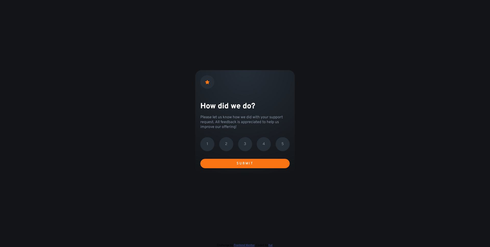

# Frontend Mentor - Interactive rating component solution

This is a solution to the [Interactive rating component challenge on Frontend Mentor](https://www.frontendmentor.io/challenges/interactive-rating-component-koxpeBUmI). Frontend Mentor challenges help you improve your coding skills by building realistic projects.

## Table of contents

- [Overview](#overview)
  - [The challenge](#the-challenge)
  - [Screenshot](#screenshot)
  - [Links](#links)
- [My process](#my-process)
  - [Built with](#built-with)
  - [What I learned](#what-i-learned)
  - [Continued development](#continued-development)
  - [Useful resources](#useful-resources)
- [Author](#author)
- [Acknowledgments](#acknowledgments)

## Overview

### The challenge

Users should be able to:

- View the optimal layout for the app depending on their device's screen size
- See hover states for all interactive elements on the page
- Select and submit a number rating
- See the "Thank you" card state after submitting a rating

### Screenshot



### Links

- Solution URL: [GitHub Repo](https://github.com/AnalystKAL/Interactive-Rating-Component)
- Live Site URL: [Live Site at GitHub Pages](https://analystkal.github.io/Interactive-Rating-Component/)

## My process

### Built with

- Semantic HTML5 markup
- CSS custom properties
- Flexbox

### What I learned

New things I learnt were about JavaScript DOM manipulation and adding gradients to background colors. Used anchor tags and target attribute to get the correct value to be shown in the thank you screen.

To see how you can add code snippets, see below:

```html
<div class="rating-value-container">
  <a href="#target1" id="target1" class="target rating-value">1</a>
  <a href="#target2" id="target2" class="target rating-value">2</a>
  <a href="#target3" id="target3" class="target rating-value">3</a>
  <a href="#target4" id="target4" class="target rating-value">4</a>
  <a href="#target5" id="target5" class="target rating-value">5</a>
</div>
```

```css
.card-container,
.thanks-container {
  display: flex;
  background: radial-gradient(
    circle at center top,
    var(--dark-blue),
    var(--very-dark-blue)
  );
  flex-direction: column;
  max-width: 35rem;
  padding: 2rem;
  border-radius: 25px;
  gap: 1.5rem;
}
```

```js
function changeState() {
  const url = window.location.href;
  var ratingID = url.substring(url.lastIndexOf("#") + 1);
  let rating = document.getElementById(ratingID).innerText;
  document.getElementById("rating").innerText =
    "You selected " + rating + " out of 5";

  const getOnClick = document.querySelector("#onclick");
  const initial = document.querySelector("#initial");

  initial.style.display = "none";
  getOnClick.style.display = "flex";
}
```

### Continued development

Gradient of the background color needs improving. So I need to watch a tutorial on radial-gradients.

### Useful resources

- [MDN web docs about Radial Gradients](https://developer.mozilla.org/en-US/docs/Web/CSS/gradient/radial-gradient) - Helped me on how to place the gradients at center top.
- [Web Dev Simplified's video on DOM manipulation](https://www.youtube.com/watch?v=y17RuWkWdn8) - This video helped me quickly learn JavaScript and utilize it in DOM manipulation.

## Author

- GitHub Profile - [@AnalystKAL](https://github.com/AnalystKAL)
- Frontend Mentor - [@AnalystKAL](https://www.frontendmentor.io/profile/AnalystKAL)

## Acknowledgments

Thanks to Web Dev Simplified on a quick tutorial about DOM manipulation and Kevin Powell tutorials on Flexbox.
